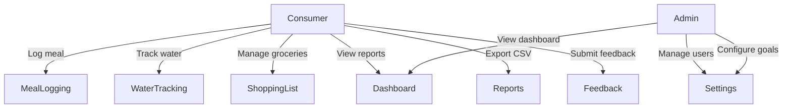
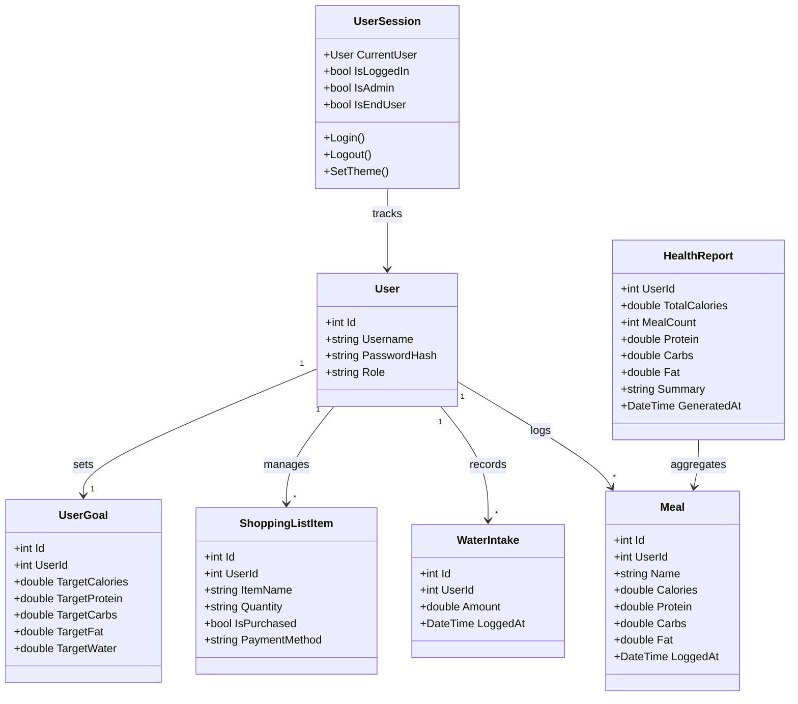
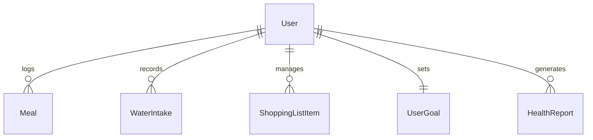
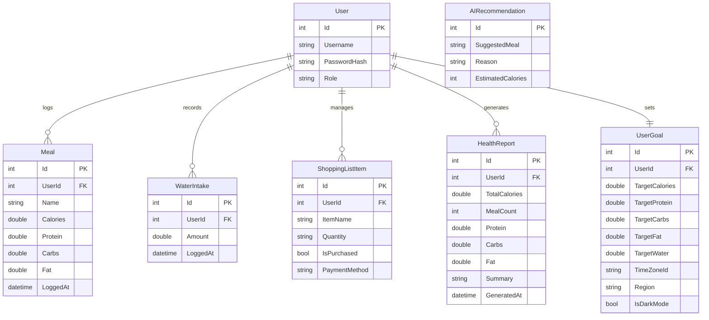

# SmartBit (formerly SmartBite)

> A professional Blazor-based health companion — meal logging, water tracking, grocery planning, and role-aware access with enterprise-ready MSI installer.

> ⚠️ **Requires .NET 10 or .NET 11 Preview SDK.** Earlier SDK versions are not supported.

[](https://dotnet.microsoft.com/)
[](LICENSE.md)
[](https://github.com/ZeroTrace0245/SmartBit/releases)
[](https://www.microsoft.com/windows)

---

## Overview

SmartBit helps end users track daily calories/macros, water intake, and groceries while giving admins control over settings and user management. The UI uses a mica/acrylic-inspired theme with light/dark toggle, sticky navigation, and CSV data exports.

### 🎁 **NEW: Professional Installation Package**

SmartBit now includes a **professional MSI installer** for enterprise deployment:
- ✅ **Windows Installer Package (.msi)** - 90.8 MB
- ✅ **Add/Remove Programs Integration**
- ✅ **Start Menu & Desktop Shortcuts**
- ✅ **Group Policy Deployment Ready**
- ✅ **Silent Installation Support**
- ✅ **Automatic Uninstaller**

📦 **Download:** [SmartBit-v1.0-Setup.msi](MSI-Installer/Output/SmartBit-v1.0-Setup.msi)

---

## Feasibility Study

### Operational Feasibility
- Target users (health-conscious individuals) are familiar with web-based dashboards and mobile-responsive layouts.
- Role separation (admin vs consumer) maps directly to real-world access needs — admins manage users/settings; consumers track personal health data.
- Minimal training required: the UI follows familiar patterns (sidebar navigation, card-based dashboards, form inputs).

### Technical Feasibility
- Built on .NET 10 / .NET 11 Preview with Blazor Server — mature, well-documented stack with strong tooling (Visual Studio, dotnet CLI).
- SQLite database (`SmartBite.db`) via Entity Framework Core for lightweight persistent storage; swappable to SQL Server/PostgreSQL without code changes.
- JS interop (`IJSRuntime`) handles theme persistence and file downloads where Blazor alone is insufficient.

### Economical Feasibility
- All core tools are free/open-source: .NET SDK, Bootstrap, Entity Framework Core.
- Hosting can run on any machine with the .NET 10 (or .NET 11 Preview) runtime — no paid cloud dependency required for development.

---

## System Architecture

### Use Case Diagram


### Class Diagram of Proposed System


### ER Diagram


### High-Level Architectural Diagram
```
┌─────────────────────────────────────────────────┐
│                   Browser                       │
│  ┌───────────────────────────────────────────┐  │
│  │  Blazor Server (SignalR)                  │  │
│  │  MainLayout · NavMenu · Pages             │  │
│  │  UserSession · IJSRuntime interop         │  │
│  └────────────────┬──────────────────────────┘  │
└───────────────────┼─────────────────────────────┘
                    │ HTTP (SmartBiteApiClient)
┌───────────────────┼─────────────────────────────┐
│  computer_project.ApiService                    │
│  ┌────────────────┴──────────────────────────┐  │
│  │  ASP.NET Core Minimal APIs                │  │
│  │  /meals · /water · /shoppinglist          │  │
│  │  /stats · /goals · /users                 │  │
│  └────────────────┬──────────────────────────┘  │
│                   │                             │
│  ┌────────────────┴──────────────────────────┐  │
│  │  EF Core + SQLite (SmartBite.db)          │  │
│  │  AppDbContext                             │  │
│  └───────────────────────────────────────────┘  │
└─────────────────────────────────────────────────┘
```

---

## Development Tools and Technologies

### Development Methodology
- Iterative/incremental: features added in vertical slices (UI + API + model per feature).
- Source control via Git on GitHub (`master` branch, feature commits).
- Professional installation packaging via WiX Toolset v3.

### Programming Languages and Tools
| Tool / Language | Purpose |
| --- | --- |
| C# 14 / .NET 10–11 | Backend API and Blazor UI logic |
| Razor (`.razor`) | Component markup and rendering |
| HTML / CSS | Layout, styling, mica/acrylic effects |
| JavaScript | Theme toggle and file download via `IJSRuntime` |
| PowerShell / dotnet CLI | Build, restore, run, watch, packaging |
| Visual Studio 2026 Insiders | Primary IDE |
| Git + GitHub | Version control and collaboration |
| WiX Toolset v3 | MSI installer creation |
| Inno Setup | Alternative installer option |

### Third-Party Components and Libraries
| Library | Role |
| --- | --- |
| Bootstrap 5 | Responsive grid, buttons, cards, dropdowns |
| Bootstrap Icons | Icon set (`bi bi-*`) used across the UI |
| Entity Framework Core + SQLite | ORM and persistent data access (`SmartBite.db`) |
| .NET Aspire (`ServiceDefaults`) | Shared service wiring and defaults |
| WiX Toolset | Windows Installer XML for MSI packaging |

### Algorithms
- **Macro aggregation**: server-side LINQ summation of calories, protein, carbs, fat across logged meals to produce `HealthReport`.
- **Checkout tracker simulation**: client-side stepped progress (10 stages × timed delay) with status log injection and automatic purchase-state update on completion.
- **Role-based rendering**: `UserSession` exposes `IsAdmin` / `IsEndUser` flags; components conditionally render UI blocks at the Razor level.

---

## Implementation Progress

### Installation Options

#### Option 1: MSI Installer (Recommended for End Users)
1. Download [SmartBit-v1.0-Setup.msi](MSI-Installer/Output/SmartBit-v1.0-Setup.msi)
2. Double-click to install
3. Launch from Start Menu or Desktop shortcut

**Silent Installation:**
```cmd
msiexec /i "SmartBit-v1.0-Setup.msi" /quiet
```

See [MSI-INSTALLER-COMPLETE.md](MSI-INSTALLER-COMPLETE.md) for full installation guide.

#### Option 2: Development Environment Setup (For Developers)
1. Install the [.NET 10 SDK](https://dotnet.microsoft.com/download/dotnet/10.0) or the [.NET 11 Preview SDK](https://dotnet.microsoft.com/download/dotnet/11.0).
2. Clone the repository:
   ```bash
   git clone https://github.com/ZeroTrace0245/SmartBit.git
   cd SmartBit
   ```
3. Restore dependencies:
   ```bash
   dotnet restore
   ```
4. Run the API:
   ```bash
   dotnet run --project computer_project.ApiService
   ```
5. Run the UI with hot reload:
   ```bash
   dotnet watch --project computer_project.Web
   ```

### Building Your Own Installer

#### Quick Build (ZIP Package)
```powershell
.\Build-Installer.ps1
```
Output: `Installer-Output\SmartBit-v1.0-Setup.zip`

#### Professional MSI Build
Prerequisites: WiX Toolset v3
```powershell
winget install WiXToolset.WiXToolset
.\Build-Installer.ps1  # Build application package first

# Compile MSI
& "C:\Program Files (x86)\WiX Toolset v3.14\bin\candle.exe" `
    ".\MSI-Installer\SmartBit.wxs" `
    -out ".\MSI-Installer\SmartBit.wixobj" `
    -ext WixUIExtension -arch x64

# Link to MSI
& "C:\Program Files (x86)\WiX Toolset v3.14\bin\light.exe" `
    ".\MSI-Installer\SmartBit.wixobj" `
    -out ".\MSI-Installer\Output\SmartBit-v1.0-Setup.msi" `
    -ext WixUIExtension -cultures:en-us -sval
```

See [MSI-INSTALLER-GUIDE.md](MSI-INSTALLER-GUIDE.md) for detailed build instructions.

### Implemented Features
| Feature | Status | Details |
| --- | --- | --- |
| Meal logging | ✅ Done | Add meals, view history, macro breakdown |
| Dashboard & reports | ✅ Done | Daily summary cards, CSV export, tips |
| Water tracking | ✅ Done | Log intakes, view history |
| Shopping list | ✅ Done | Add/delete items, payment tagging, checkout tracker |
| **Payment methods** | ✅ Done | Cash, Credit Card, Apple Pay, Google Pay, Bank Transfer |
| **Third-party payment integration** | ✅ Done | PayPal and Stripe checkout simulation |
| Role-based access | ✅ Done | Admin-only Settings; consumers blocked |
| Light/dark theme | ✅ Done | JS interop toggle, mica/acrylic effects |
| Feedback page | ✅ Done | Contact/help entry point |
| User registration/login | ✅ Done | Simple credential flow (demo, no hashing) |
| **MSI Installer** | ✅ Done | Professional Windows Installer package |
| **ZIP Package** | ✅ Done | Portable installation package |
| AI Health Coach | ⚠️ In Progress | Chat-based nutrition advice via AI Foundry Local — runs entirely on-device, no API keys needed |

---

## Screenshots & Demos

| View | Preview |
| --- | --- |
| Startup |  |
| Dashboard |  |
| Home |  |
| Log History |  |
| Performance |  |
| Hydration |  |
| Groceries |  |
| Settings (admin) |  |
| Settings (consumer blocked) |  |
| Support |  |
| Labs |  |
| Connection/Rejoin error |  |
| Role-based access |  |

---

## Challenges Encountered and Solutions

| Challenge | Solution |
| --- | --- |
| Blazor Server loses connection on idle/network drop | Added reconnection error UI (`blazor-error-ui`) and user-facing reload prompt |
| Cloud AI API key integration unsuccessful | Replaced Google Gemini with **AI Foundry Local** — runs the `phi-3.5-mini` model entirely on-device; still work in progress |
| Role checks scattered across pages | Centralised in `UserSession` (`IsAdmin`, `IsEndUser`) and reusable `<ConsumerOnly>` wrapper component |
| Theme not persisting across renders | `ApplyTheme` called via `OnAfterRenderAsync` on first render; JS interop sets `data-bs-theme` attribute |
| First-run data setup | Seed data added in `Program.cs` so the SQLite database is pre-populated on first launch |

---

## Current System Limitations
- **No real authentication**: passwords stored in plain text; no token/cookie-based auth flow.
- **Single-user demo**: most endpoints default to `UserId = 1`; no multi-user session isolation.
- **No automated tests**: no unit or integration test projects in the solution.
- **AI features in progress**: AI Health Coach, nutrition estimation, and recommendations are being implemented via AI Foundry Local. The feature is functional but still under active development — expect rough edges.
- **No offline support**: Blazor Server requires a live SignalR connection; no service worker or PWA fallback.

---

## File Structure
```
SmartBit/
├── computer_project.Web/              # Blazor UI
│   ├── Components/
│   │   ├── Layout/
│   │   │   ├── MainLayout.razor
│   │   │   └── NavMenu.razor
│   │   └── Pages/
│   │       ├── Home.razor
│   │       ├── Dashboard.razor
│   │       ├── Feedback.razor
│   │       ├── Settings.razor
│   │       ├── ShoppingList.razor
│   │       ├── MealLogging.razor
│   │       ├── WaterTracking.razor
│   │       ├── Reports.razor
│   │       ├── Labs.razor
│   │       ├── Login.razor
│   │       ├── Register.razor
│   │       ├── PaymentModal.razor          # NEW: Payment method selector
│   │       └── ThirdPartyPayment.razor     # NEW: PayPal/Stripe integration
│   ├── Services/
│   │   └── UserSession.cs                  # Session management with payment preferences
│   ├── SmartBiteApiClient.cs
│   ├── Models.cs
│   └── wwwroot/
│       └── app.css
├── computer_project.ApiService/       # Backend API
│   ├── Program.cs
│   ├── Models.cs
│   ├── Data/
│   │   └── AppDbContext.cs
│   └── Services/
│       └── AIService.cs
├── computer_project.ServiceDefaults/  # Shared service wiring
│   └── Extensions.cs
├── computer_project.AppHost/          # Host / bootstrap
│   └── Program.cs
├── MSI-Installer/                     # NEW: MSI installer source
│   ├── SmartBit.wxs                   # WiX source file
│   └── Output/
│       └── SmartBit-v1.0-Setup.msi    # Built MSI package
├── Installer-Output/                  # NEW: Portable packages
│   ├── SmartBit/                      # Application files
│   └── SmartBit-v1.0-Setup.zip        # ZIP distribution
├── Build-Installer.ps1                # NEW: Build portable package
├── MSI-INSTALLER-COMPLETE.md          # NEW: MSI installation guide
├── MSI-INSTALLER-GUIDE.md             # NEW: MSI creation guide
├── PAYMENT_ENHANCEMENT_GUIDE.md       # NEW: Payment feature documentation
├── CONTRIBUTING.md                    # Contribution guidelines
├── LICENSE.md                         # MIT License
└── README.md                          # This file
```

---

## Database Design

SmartBite uses **SQLite** (`SmartBite.db`) via `Microsoft.EntityFrameworkCore.Sqlite`. The schema is managed by EF Core through `AppDbContext` (7 DbSets). On first launch, `Program.cs` seeds demo data so the app is immediately usable.

### SQL ER Diagram



### Normalisation Analysis

#### First Normal Form (1NF)

All tables satisfy 1NF: every column holds atomic (indivisible) values, each row is unique via a surrogate primary key (`Id`), and there are no repeating groups.

| Table | PK | Atomic Columns | Repeating Groups? |
| --- | --- | --- | --- |
| User | Id | Username, PasswordHash, Role | ✗ None |
| Meal | Id | UserId, Name, Calories, Protein, Carbs, Fat, LoggedAt | ✗ None |
| WaterIntake | Id | UserId, Amount, LoggedAt | ✗ None |
| ShoppingListItem | Id | UserId, ItemName, Quantity, IsPurchased, PaymentMethod | ✗ None |
| HealthReport | Id | UserId, TotalCalories, MealCount, Protein, Carbs, Fat, Summary, GeneratedAt | ✗ None |
| UserGoal | Id | UserId, TargetCalories, TargetProtein, TargetCarbs, TargetFat, TargetWater, TimeZoneId, Region, IsDarkMode | ✗ None |
| AIRecommendation | Id | SuggestedMeal, Reason, EstimatedCalories | ✗ None |

#### Second Normal Form (2NF)

All tables satisfy 2NF: each uses a single-column surrogate PK (`Id`), so partial dependencies on a composite key are impossible. Every non-key column depends on the entire PK.

| Table | PK | Non-Key Columns | Partial Dependency? |
| --- | --- | --- | --- |
| User | Id | Username, PasswordHash, Role | ✗ Single-column PK |
| Meal | Id | UserId, Name, Calories, Protein, Carbs, Fat, LoggedAt | ✗ Single-column PK |
| WaterIntake | Id | UserId, Amount, LoggedAt | ✗ Single-column PK |
| ShoppingListItem | Id | UserId, ItemName, Quantity, IsPurchased, PaymentMethod | ✗ Single-column PK |
| HealthReport | Id | UserId, TotalCalories, MealCount, Protein, Carbs, Fat, Summary, GeneratedAt | ✗ Single-column PK |
| UserGoal | Id | UserId, TargetCalories, …, IsDarkMode | ✗ Single-column PK |
| AIRecommendation | Id | SuggestedMeal, Reason, EstimatedCalories | ✗ Single-column PK |

#### Third Normal Form (3NF)

All tables satisfy 3NF: no non-key column transitively depends on the PK through another non-key column. Foreign keys (`UserId`) reference the `User` table directly and do not determine other non-key columns within the same table.

| Table | Transitive Dependency? | Notes |
| --- | --- | --- |
| User | ✗ None | Role is a direct attribute of User |
| Meal | ✗ None | UserId is an FK; Name, Calories, etc. depend only on Meal.Id |
| WaterIntake | ✗ None | Amount, LoggedAt depend only on WaterIntake.Id |
| ShoppingListItem | ✗ None | ItemName, Quantity, IsPurchased, PaymentMethod depend only on ShoppingListItem.Id |
| HealthReport | ✗ None | All aggregation fields depend only on HealthReport.Id |
| UserGoal | ✗ None | All target fields, TimeZoneId, Region, IsDarkMode depend only on UserGoal.Id |
| AIRecommendation | ✗ None | Standalone table — no FK, no transitive path |

---

## AI Features — Sneak Peek ⚠️

> ⚠️ **Work in Progress** — AI features are under active development and may change significantly before release. Screenshots below show the current state of the implementation.

> ⚠️ **AI Foundry Local must be installed** to use AI features. No cloud APIs or API keys are required — all AI processing runs entirely on your device.

SmartBite uses [AI Foundry Local](https://github.com/microsoft/ai-foundry-local) to power:
- **AI Health Coach** — chat-based nutrition advice, meal suggestions, and calorie estimates
- **Meal nutrition estimation** — automatic macro breakdown from a meal description
- **Personalised recommendations** — meal suggestions based on your recent logs and goals
- **Health report summaries** — AI-generated daily health assessments
- **Hydration tips** — motivational water intake advice

### AI Coach — Preview (work in progress)

.png)

### AI Foundry Local — Running Locally


### Setup

```bash
# Install AI Foundry Local (one-time)
winget install Microsoft.AIFoundryLocal

# Download the model used by SmartBite
foundry model download phi-3.5-mini

# Start the local server (must be running before using AI features)
foundry service start
```

The AI Coach page in SmartBite will show a live connection status indicator — green when Foundry is running, red when it's not.

---

## Distribution & Deployment

### End-User Installation

SmartBit provides multiple installation options for different scenarios:

#### 1. MSI Installer (Recommended)
**Best for:** Windows users, corporate environments, group policy deployment

- Download: [SmartBit-v1.0-Setup.msi](MSI-Installer/Output/SmartBit-v1.0-Setup.msi)
- Size: 90.8 MB
- Features: Auto-uninstaller, Start Menu shortcuts, Add/Remove Programs integration

**Installation:**
```cmd
# Interactive
msiexec /i "SmartBit-v1.0-Setup.msi"

# Silent
msiexec /i "SmartBit-v1.0-Setup.msi" /quiet
```

📖 See [MSI-INSTALLER-COMPLETE.md](MSI-INSTALLER-COMPLETE.md) for complete guide.

#### 2. ZIP Package (Portable)
**Best for:** Quick testing, portable installations

- Download: [SmartBit-v1.0-Setup.zip](Installer-Output/SmartBit-v1.0-Setup.zip)
- Extract and run `Start-SmartBit.bat`

### Enterprise Deployment

#### Group Policy Deployment
1. Copy `SmartBit-v1.0-Setup.msi` to network share
2. Open Group Policy Management Console
3. Navigate to: Computer Configuration → Policies → Software Settings → Software Installation
4. Right-click → New → Package
5. Select the MSI file

#### SCCM/Intune Deployment
The MSI package is compatible with System Center Configuration Manager and Microsoft Intune for enterprise software distribution.

#### Silent Installation for Mass Deployment
```cmd
msiexec /i "\\network-share\SmartBit-v1.0-Setup.msi" /quiet /l*v "C:\Logs\smartbit-install.log"
```

### System Requirements
- **OS:** Windows 10 (1809+) or Windows 11
- **Architecture:** x64 (64-bit)
- **.NET Runtime:** Included (self-contained)
- **Disk Space:** ~200 MB
- **RAM:** 512 MB minimum, 1 GB recommended
- **Optional:** AI Foundry Local for AI features

---

## Future Plans
- ⚠️ **AI features full release**: The AI Health Coach, nutrition estimation, and recommendation features are currently work in progress. A stable release is planned once testing and prompt tuning are complete.
- ⚠️ **AI Foundry Local integration**: In a future release, the AI backend may be updated to support AI Foundry Local, allowing for the users to run models locally.
- Migrate from SQLite to SQL Server or PostgreSQL for production-grade scalability.
- Add ASP.NET Core Identity or token-based authentication with password hashing.
- Implement multi-user session isolation (per-user data scoping).
- Add unit and integration test projects.
- Expand reports with trend charts and PDF/Excel export.
- Improve offline/connection handling and reconnection UX.
- Add push notifications for hydration and meal reminders.

---

## Contributing

We welcome contributions! Please see [CONTRIBUTING.md](CONTRIBUTING.md) for guidelines on:
- Code standards and conventions
- Branching strategy
- Pull request process
- Testing requirements
- Installer packaging guidelines

### Quick Contribution Guide

1. Fork the repository
2. Create a feature branch: `git checkout -b feature/your-feature-name`
3. Make your changes and test thoroughly
4. Update documentation if needed
5. Submit a pull request with a clear description

For detailed contribution guidelines, ownership information, and development workflows, see [CONTRIBUTING.md](CONTRIBUTING.md).

---

## License

This project is licensed under the MIT License - see [LICENSE.md](LICENSE.md) for details.

---

## Acknowledgments

- Microsoft for .NET and Blazor frameworks
- WiX Toolset for professional installer creation
- Bootstrap team for responsive UI components
- Entity Framework Core team for data access
- AI Foundry Local team for on-device AI capabilities

---

## Support & Contact

- **Issues:** [GitHub Issues](https://github.com/ZeroTrace0245/SmartBit/issues)
- **Discussions:** [GitHub Discussions](https://github.com/ZeroTrace0245/SmartBit/discussions)
- **Documentation:** Check the `docs/` folder and `.md` files in the repository

---

**Made with ❤️ using .NET 11, Blazor, and modern Windows installer technology**