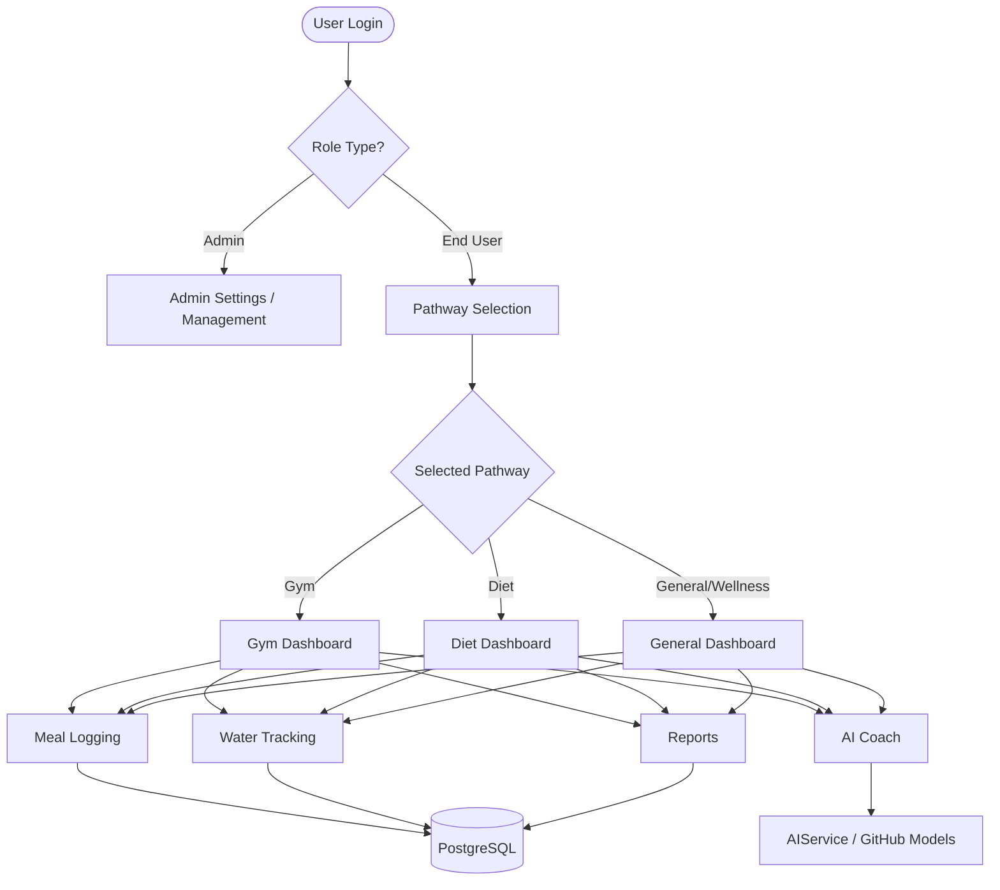
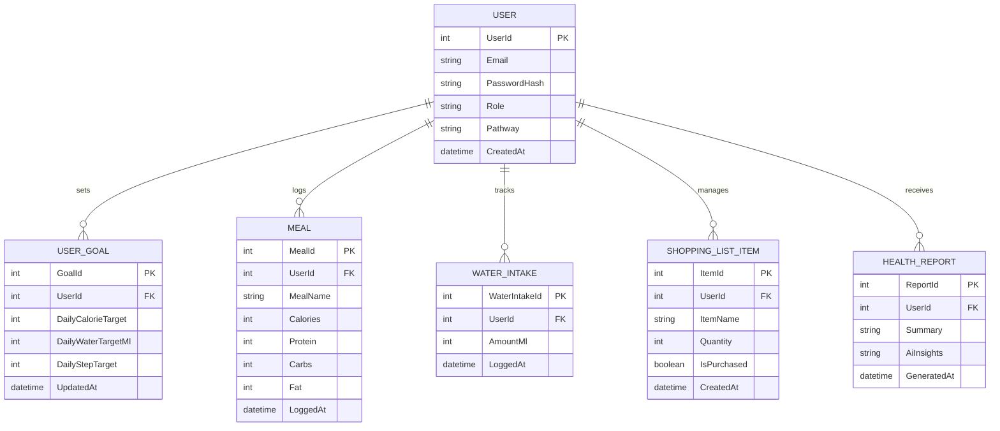
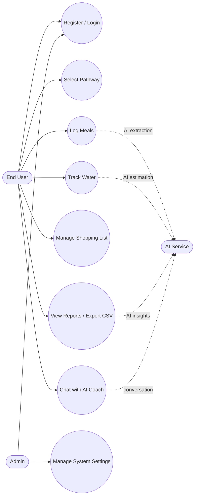
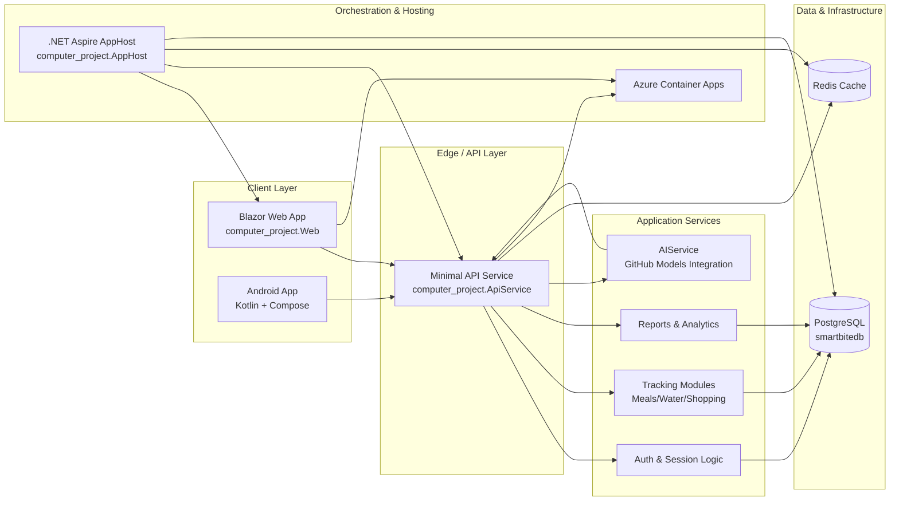

# Final Report — SmartBite Intelligent Health Tracking System

## Title [Front Cover] Page
**Project Title:** SmartBite – Intelligent Pathway-Based Health Tracking Platform  
**Module:** PUSL2021 Computing Group Project  
**Academic Year:** 2025/2026  
**Institution:** [Insert Institution Name]  
**Supervisor:** [Insert Supervisor Name]  
**Team ID / Group:** [Insert Group Details]  
**Submission Date:** [Insert Date]

---

## Acknowledgements
Appreciation is expressed to the project supervisor for technical direction and milestone reviews. Recognition is also extended to all team members for system design, implementation, testing, and documentation work. Feedback provided by peer evaluators and demonstration users supported practical refinement of both web and mobile experiences.

---

## Abstract
SmartBite was implemented as a pathway-driven digital health platform consisting of a Blazor web application and a Kotlin-based Android mobile application. Meal logging, hydration tracking, shopping list planning, sleep and step monitoring, and AI-assisted coaching were centralized within one ecosystem. The architecture was composed of a Blazor frontend (`computer_project.Web`), an ASP.NET Core Minimal API backend (`computer_project.ApiService`), and Aspire orchestration (`computer_project.AppHost`) with PostgreSQL and Redis integrations.

AI capabilities were powered by GitHub Models (notably GPT-4o-mini in orchestration and chat integrations), and smart features were delivered across meal extraction, hydration estimation, grocery suggestions, report insights, and conversational coaching. Deployment was completed on Azure Container Apps (`webfrontend.victoriousbush-9c923eb9.southeastasia.azurecontainerapps.io`), and deployment metadata was defined in `computer_project.AppHost/azure.yaml`.

Pathway-specific personalization (Gym, Diet, General/Wellness) was introduced, and each pathway was represented through distinct dashboard cards, performance insights, and color themes. Compared to the legacy version, stronger pathway modularity, deeper AI embedding, improved UX consistency, and expanded mobile-first visual design (“Glow UI”) were demonstrated. Overall feasibility, extensibility, and readiness for iterative academic and production-level enhancement were demonstrated.

---

## Table of Contents
1. Introduction  
2. Literature Review  
3. System Analysis  
4. Requirements Specification  
5. System Architecture  
6. Method of Approach / Methodology  
7. System Testing and Quality Assurance  
8. Conclusions  
9. Team Plan & Responsibility Matrix  
10. Reference List  
11. Appendices

---

## List of Figures and Tables

### Figures
- Figure 1: Legacy Web Home (`screenshots/Home page.png`)
- Figure 2: New Web Home (`screenshots/Web app NEW/New homepage.png`)
- Figure 3: New Pathway Selection (`screenshots/Web app NEW/New pathway selection.png`)
- Figure 4: New Gym Dashboard (`screenshots/Web app NEW/New pathway pesonalized Dashboard (gym).png`)
- Figure 5: New Diet Dashboard (`screenshots/Web app NEW/New pathway pesonalized Dashboard (diet).png`)
- Figure 6: New General Dashboard (`screenshots/Web app NEW/New pathway pesonalized Dashboard (genaral users).png`)
- Figure 7: AI Coach (`screenshots/Web app NEW/New AI coach.png`)
- Figure 8: Azure Hosting Evidence (`screenshots/Web app NEW/Azure.png`)
- Figure 9: Mobile Pathway Dashboards (`screenshots/Mobile app/Mobile Pathway Dashboard ...`)
- Figure 10: Mobile AI Coach (`screenshots/Mobile app/Mobile AI Coach .png`)
- Figure 11: Pathway Decision Flow Diagram (`Appendix I`)
- Figure 12: SmartBite ER Diagram (`Appendix I`)
- Figure 13: User Interaction / Use-Case Diagram (`Appendix I`)
- Figure 14: High-Level Architecture Diagram (`Appendix I`)

### Tables
- Table 1: Functional Requirements  
- Table 2: Non-Functional Requirements  
- Table 3: Technology Stack  
- Table 4: Old vs New Version Comparison  
- Table 5: Team Responsibility Matrix

---

# Main Body of Report

## Chapter 01 – Introduction

### 1.1 Background
Digital wellness tracking was frequently fragmented across separate applications for food logging, hydration, planning, and performance. In this study, those concerns were consolidated into a pathway-aware system with AI support and cloud deployment.

### 1.2 Problem Statement
Conventional lightweight trackers were observed to lack pathway-specific coaching context, integrated AI workflow, role-aware navigation, unified web/mobile architecture, and deployable cloud-native structure.

### 1.3 Aim
To develop a complete pathway-personalized, AI-assisted health platform with a modern web frontend, scalable service architecture, and companion mobile experience.

### 1.4 Objectives
1. Pathway-specific dashboards and navigation were implemented.
2. AI interactions for meals, hydration, groceries, and coaching were provided.
3. Deployment on Azure with service orchestration was completed.
4. Cross-platform consistency between web and mobile was delivered.

### 1.5 Project Scope and Boundaries
The implemented scope was focused on high-value user journeys that could be validated within the project duration. The core scope included account access, pathway onboarding, dashboard personalization, meal and hydration logging, shopping workflows, AI-supported interaction points, and reporting. Mobile parity for primary use cases was also included, so user journeys could continue when transitions from desktop to mobile were made.

Several enterprise-grade concerns were intentionally excluded from the first final release, including full production identity federation, payment gateway certification, and advanced observability dashboards with centralized telemetry pipelines. These items were identified as roadmap features and were documented in the conclusion and future work sections.

### 1.6 Expected Outcomes
Expected outcomes were defined at both technical and user-experience levels. At the technical level, an operational distributed architecture using Blazor (.NET 11), Minimal APIs, PostgreSQL, Redis, and Azure hosting was expected to be demonstrated. At the UX level, clear pathway differentiation, reduced interaction friction for logging tasks, and measurable clarity in navigation structure across role types were expected to be demonstrated.

### 1.7 Document Structure Rationale
The report structure was aligned to the required chapter pattern so traceability from problem identification to implementation evidence could be preserved. Chapters 1–3 were used for motivation and analysis, Chapter 4 was used to formalize requirements, Chapters 5–6 were used to describe architecture and method, Chapter 7 was used to present validation evidence, and the final chapters were used to summarize outcomes and governance artifacts.

---

## Chapter 02 – Literature Review

### 2.1 Domain Review
Health applications generally focus on isolated modules (calorie tracker only, hydration only, or fitness only). Integrated systems with pathway-specific personalization and AI actionability remain less common.

In prior studies of consumer health systems, three recurring limitations were observed. First, nutrition logging interfaces were often data-heavy and manually intensive, causing entry fatigue and high drop-off after initial onboarding. Second, behavior-tracking modules (hydration, sleep, and step monitoring) were usually presented as independent tools without a unified interpretation layer. Third, users frequently received generic recommendations that did not account for pathway intent (for example, muscle-gain users receiving weight-loss-oriented advice).

Within that context, SmartBite was positioned as a response to practical adoption barriers rather than only as a feature-complete tracker. Reduction of interaction friction and context-sensitive guidance through pathway selection and AI support at decision points were emphasized.

### 2.2 Technology Trends
- Component-first web frameworks (Blazor).
- API-first service segmentation.
- AI copilots integrated into operational pages.
- Cloud-native hosting patterns with containerization.

These trends have become significant in modern digital health engineering because maintainability, deployment speed, and user personalization requirements have increased simultaneously. A component-first frontend such as Blazor supports reusable views and state models across feature modules. API-first segmentation allows future mobile and partner integrations with stable contracts. Cloud-native deployment patterns enable repeatable environments and consistent release pipelines.

The same trend has also appeared on mobile platforms where declarative frameworks (e.g., Jetpack Compose) have replaced imperative UI approaches. This shift has improved testability and enabled animation-rich but maintainable interfaces.

### 2.3 Relevance to SmartBite
Alignment with these trends was achieved by combining a Blazor interactive frontend, Minimal API backend, Aspire orchestration, GitHub Models AI, and Azure Container Apps hosting.

The chosen stack was evaluated as appropriate for academic and practical outcomes because full-stack consistency in the .NET ecosystem was enabled while independent scaling of core services was still supported. Manual service bootstrap complexity was reduced through Aspire orchestration, and service dependencies were made explicit. Redis and PostgreSQL were selected to represent production-realistic architectural behavior rather than purely local demonstration behavior.

### 2.4 Design Principles Derived from Literature
Based on reviewed platform and framework guidance, the project adopted five practical principles:
1. **Separation of concerns:** UI state, API contracts, and persistence concerns were decoupled.
2. **Progressive enhancement:** AI features augment workflows but do not block baseline core functionality.
3. **Contextual personalization:** pathway-specific rendering improves decision quality and user relevance.
4. **Cloud-readiness:** the system is deployable with container-oriented orchestration and managed services.
5. **Cross-platform continuity:** equivalent user intents are represented across web and mobile applications.

These principles were operationalized through code-level decisions:
- pathway checks were performed in dedicated UI rendering branches,
- AI operations were wrapped in service calls with fallback behavior,
- navigation and dashboard modules reused consistent card paradigms,
- mobile and web maintained parallel functional intent even where implementation differed.

### 2.5 Gap Addressed by the Project
Many health tools were found to provide either deep tracking with weak personalization, or attractive interfaces with weak operational integration. In this project, that gap was addressed through pathway-level personalization combined with actionable AI at operational points (logging, planning, and interpretation), while a conventional and testable API-backed architecture was preserved.

### 2.6 Comparative Technology Positioning
To justify stack choices, candidate approaches were reviewed against project criteria (learning curve, deployment suitability, scalability, integration complexity, and maintainability). Table 2.6 summarizes this positioning.

| SmartBite Decision |
|---|---|---|---|---|
| Web UI Framework | Razor Pages / MVC | Mature and familiar | Less component-centric for dynamic dashboard composition | Blazor Interactive Server selected |
| API Style | Full controller architecture | Strong structure | More boilerplate for rapid iteration | Minimal APIs selected |
| Orchestration | Manual docker-compose service wiring | Transparent control | Higher setup/maintenance overhead for team | .NET Aspire selected |
| AI Provider Pattern | Direct vendor SDK-only coupling | Fast initial integration | Vendor lock and mixed abstractions risk | GitHub Models + chat abstraction selected |
| Mobile UI | XML Views + Fragments | Legacy ecosystem coverage | Slower UI iteration and animation complexity | Jetpack Compose selected |

### 2.7 Personalization in Digital Health: Evidence-Informed Rationale
Literature in health informatics has repeatedly shown that engagement increases when interfaces reflect user goals and self-identity. In this project, pathway identity (Gym, Diet, Wellness/General) was treated as a first-class context parameter. This allowed metric ordering, visual emphasis, and action prompts to align with user intent. For example:
- Gym pathway emphasized performance and recovery indicators.
- Diet pathway emphasized nutrient balance and intake control.
- General pathway emphasized everyday habits and consistency.

This pathway model was chosen because it created a practical middle layer between fully generic interfaces and fully clinical personalization, making it suitable for educational delivery scope.

### 2.8 AI in Consumer Wellness Interfaces
Current AI literature warns that generative systems in health domains require guardrails, especially when users might interpret output as medical diagnosis. In SmartBite, this risk was addressed through prompt framing and constrained output patterns for data extraction tasks. AI output was used for supportive coaching, planning suggestions, and estimation tasks, while user-controlled confirmation remained part of critical logging flows.

From an interaction perspective, AI was embedded directly where decisions occur (meal logging, hydration estimation, shopping suggestions, reports interpretation), rather than isolated in a single “chat-only” location. This was informed by usability research indicating that contextual assistance generally outperforms detached assistants.

### 2.9 Cloud-Native Deployment Relevance
Academic prototypes often remain local and therefore do not surface practical deployment concerns. In SmartBite, cloud deployment on Azure Container Apps was intentionally included to demonstrate production-adjacent behavior: endpoint exposure, container lifecycle, distributed dependencies, and operational environment consistency.

This decision also improved evaluation quality because assessors could observe a hosted runtime rather than static screenshots only. It provided stronger evidence for scalability planning and deployment readiness.

### 2.10 Literature Review Summary
The literature and platform evidence supported a blended architecture where modular UI composition, API-first boundaries, contextual AI, and cloud deployment were combined. The final design reflected this synthesis and targeted practical usability rather than isolated technical novelty. The chapter therefore established theoretical and engineering justification for the architecture and workflow decisions detailed in Chapters 5 and 6.

---

## Chapter 03 – System Analysis

### 3.1 Stakeholders
- End users (Gym, Diet, Wellness/General pathways)
- Admin users (settings and management)
- Development team and assessors

### 3.2 Existing (Legacy) Issues
Legacy screenshots indicate a flatter experience with less pathway personalization and early AI status indicators (e.g., `AI (working on Prograess).png`, `Local Foundary.png`, `severnot connected.png`).

### 3.3 Proposed Solution
The new system introduces:
- pathway-driven dashboard rendering (`Dashboard.razor`),
- pathway-aware navigation (`NavMenu.razor`),
- AI-assisted feature pages (Meal, Water, Shopping, Reports, AI Coach),
- Azure-hosted endpoint and Aspire-managed service graph.

### 3.4 User Pathways
- **Gym:** Calories Burned, Workout Volume, Supplements, Recovery.
- **Diet:** Calorie Intake, Protein Tracking, Weight Analytics, Nutrient Score.
- **General/Wellness:** Steps, Hydration, Sleep, Mood/Habits.

### 3.5 As-Is vs To-Be Analysis
The legacy baseline was represented by a mostly generic experience in which broad modules were navigated manually without pathway-level guidance. AI capabilities were presented as isolated experimental features. In contrast, pathway-oriented cards and links were rendered at entry points in the new system, and goal-aligned actions were therefore completed with fewer context switches.

**As-Is characteristics (legacy):**
- limited pathway adaptation,
- fragmented feature emphasis,
- early-stage AI accessibility indicators,
- less consistent visual signaling for priorities.

**To-Be characteristics (new):**
- pathway-aware dashboards and navigation,
- AI embedded inside core user tasks,
- improved visual language for status and priority,
- stronger cloud deployment readiness and service orchestration.

### 3.6 User Journey Summary
The typical web user journey was initiated at home/login, then proceeded to pathway selection, and then transitioned into a pathway-personalized dashboard. From that stage, modular workflows (meal logging, hydration, shopping, reports, AI coach) were entered. The journey was designed so quick actions and contextual links reduced required interactions for high-frequency behaviors such as adding meals and water.

The typical mobile journey was started from login/create-account screens, followed by route-based navigation in `SmartBitApp.kt`, with persistent access to dashboard, trackers, performance, chat, and settings. Pathway theme selection was used to change both visual tone and content emphasis.

### 3.7 Roles and Access Behavior
Two role categories are implemented:
- **End-user/consumer role:** full access to personal tracking, pathway features, reports, and AI tools.
- **Admin role:** system-level settings views and management-oriented controls.

Role-aware rendering occurs at UI navigation level and page-level component conditions, reducing accidental access to management operations.

---

## Chapter 04 – Requirements Specification

### 4.1 Functional Requirements (Table 1)
| ID | Requirement | Priority |
|---|---|---|
| FR01 | User login and role session | High |
| FR02 | Pathway selection and personalized dashboard | High |
| FR03 | Meal logging with manual, AI, and barcode-assisted data | High |
| FR04 | Water tracking with AI-based intake estimation | High |
| FR05 | Shopping list with AI suggestions and payment flow | High |
| FR06 | AI coach conversational interface | High |
| FR07 | Performance analytics and CSV export | Medium |
| FR08 | Admin and user settings separation | High |

### 4.2 Non-Functional Requirements (Table 2)
| ID | Requirement | Target |
|---|---|---|
| NFR01 | Usability | Clear navigation and visual hierarchy |
| NFR02 | Scalability | Distributed architecture (Postgres + Redis + Aspire) |
| NFR03 | Availability | Cloud-hosted on Azure Container Apps |
| NFR04 | Maintainability | Modular page/service boundaries |
| NFR05 | Responsiveness | Desktop and mobile-friendly experiences |

### 4.3 Requirement-to-Feature Mapping
- FR02 maps to pathway selection and dynamic UI branches in dashboard/navigation.
- FR03 maps to `MealLogging.razor` including manual entry, AI extraction, and barcode flows.
- FR04 maps to `WaterTracking.razor` with quick-add and AI hydration estimate.
- FR05 maps to `ShoppingList.razor` including AI suggestions and purchase-state updates.
- FR06 maps to `AICoach.razor` and API AI endpoints.
- FR07 maps to `Reports.razor` and CSV extraction logic.

This explicit mapping was maintained so chapter-to-code traceability could be ensured and verification could be simplified.

### 4.4 Data Requirements (Summary)
Core entities include User, Meal, WaterIntake, ShoppingListItem, UserGoal, and HealthReport. Data requirements emphasize timestamped event logs (meals, water), per-user goal settings, and generated summaries for analytics and AI prompts. The schema design supports extension for multi-user segmentation and historical trend persistence.

### 4.5 Constraints and Assumptions
AI outputs were probabilistic and required robust fallback text.
Stable internet access was assumed for cloud-backed web access.
Some seeded values were present for demonstration acceleration.
Mobile and web parity was functional, although full real-time synchronization across all features was not yet completed.

---

## Chapter 05 – System Architecture

### 5.1 High-Level Components
- **Frontend:** `computer_project.Web` (Blazor, Interactive Server).
- **Backend:** `computer_project.ApiService` (ASP.NET Core Minimal APIs).
- **Orchestration:** `computer_project.AppHost` (Aspire service wiring).
- **Data:** PostgreSQL (`smartbitedb`) and Redis cache.

### 5.2 AI Stack
- AppHost binds GitHub Model `gpt-4o-mini`.
- `AIService` provides chat, nutrition estimation, recommendations, health summaries, hydration advice.
- Web pages consume AI:
  - `AICoach.razor`
  - `MealLogging.razor`
  - `ShoppingList.razor`
  - `WaterTracking.razor`
  - `Reports.razor`
  - `Dashboard.razor` (predictive insight)

### 5.3 Hosting Platform
- Azure definition in `computer_project.AppHost/azure.yaml`.
- Live endpoint in `link.txt`:  
  `https://webfrontend.victoriousbush-9c923eb9.southeastasia.azurecontainerapps.io/`

### 5.4 Pathway-Specific Dashboard Colors and Widgets
#### Gym Theme (Red)
- Color emphasis: `text-danger`, `bg-danger` cards.
- Widgets: Calories Burned, Workout Volume, Supplements, Recovery.
- Additional panel: Goal Setting and recovery reminder.

#### Diet Theme (Green)
- Color emphasis: `text-success`, `bg-success` cards.
- Widgets: Calorie Intake, Protein, Weight, Nutrient Score.
- Additional panel: Nutrient Insights and grocery generation.

#### General Theme (Blue/Purple)
- Color emphasis: `text-primary`, blue-purple gradients.
- Widgets: Daily Steps, Hydration, Sleep Score, Mood Logs.
- Additional panel: Habit Builder with motivation block.

### 5.5 Navigation Pathways
`NavMenu.razor` dynamically switches links by pathway and role:
- Gym and Diet menus are context-specific.
- Shared modules include Home, Log History, Performance, AI Coach, Hydration, Groceries, Sleep, Steps, Community, Policies, Labs.
- Admin-specific section exposes system settings.

### 5.6 Mobile System Overview
As documented in `mobile final.md` and corresponding source modules:
- Kotlin + Jetpack Compose + MVVM + Hilt.
- Retrofit/OkHttp, Room, Coroutines/Flow, WorkManager.
- Dynamic pathways in `SmartBitApp.kt` and themed cards in `DashboardScreen.kt` were implemented.
- Animated gradient and glow behavior in `Gradients.kt` was implemented.
- Scheduled background work in `WorkScheduler.kt` was configured:
  - Hydration reminders every 2 hours.
  - Offline sync every 15 minutes (network constrained).

### 5.7 End-to-End Request Flow (Web)
1. User performs an action in a Blazor page (e.g., add meal).
2. `SmartBiteApiClient` sends request to API service.
3. API endpoint validates input and persists data through `AppDbContext`.
4. Redis caching and service defaults support resilience and distributed behavior.
5. Response is returned to UI and rendered immediately in component state.
6. If AI is requested, `AIService` generates response through configured chat client and returns structured or textual output.

This flow model was reused across meal, water, shopping, and reports modules so consistency could be maintained.

### 5.8 AI Integration Strategy and Safeguards
AI was integrated with a “feature-assist” strategy: all core tasks could be completed without AI, while acceleration and interpretation were provided by AI when available. Prompt design emphasized constrained outputs (especially JSON formats for extraction scenarios). Parsing logic was used to remove code-fence wrappers and malformed payloads were handled gracefully. Where AI connectivity was unavailable, workflow continuity was preserved through user-facing fallback messages.

### 5.9 UI/UX Evolution: Old vs New Screens
Web app NEW screenshots indicated strong progression from baseline screens to pathway-personalized experiences. Notable improvements included:
- unified card-based information hierarchy,
- pathway-specific dashboard headers and metrics,
- expanded AI touchpoints across groceries, hydration, performance, and meal logging,
- clearer first-run flow via modern sign-in and pathway selection screens,
- stronger support pages (policies, labs, help/support, community) integrated with consistent style.

Legacy screenshots were retained in appendices so design evolution and decision traceability could be evidenced.

### 5.10 Mobile Architecture Detail
Mobile architecture was implemented through route-driven composition with a shared theme state. In `SmartBitApp.kt`, the navigation graph and UI shell (drawer, top bar, bottom bar) were defined, while screen modules were kept focused on individual workflows. In `Gradients.kt` and `PathwayTheme.kt`, a scalable approach to visual personalization was provided.

WorkManager integration (`HydrationReminderWorker`, `OfflineSyncWorker`) was used to support background reliability. Practical usability was improved for users who did not keep the app continuously open.

### 5.11 Chapter Balance Expansion — System Decomposition by Pathway
To improve chapter weighting and marking balance, pathway decomposition was documented at subsystem level.

#### 5.11.1 Gym Subsystem Decomposition
In the Gym subsystem, performance-oriented metrics were prioritized. Red visual signaling was applied to emphasize training intensity and recovery urgency. The following functional units were grouped:
- energy expenditure display,
- workout volume indicators,
- supplement compliance panel,
- recovery readiness indicators.

This decomposition was selected so training-related decisions could be made rapidly from the dashboard without deep navigation.

#### 5.11.2 Diet Subsystem Decomposition
In the Diet subsystem, intake control and macro quality were prioritized. Green visual signaling was applied to represent nutrition compliance. The following functional units were grouped:
- calorie intake tracking,
- protein target tracking,
- weight analytics summary,
- nutrient score presentation.

This decomposition was selected so nutritional decision support could be accessed through a single pathway view.

#### 5.11.3 General/Wellness Subsystem Decomposition
In the General/Wellness subsystem, habit consistency was prioritized. Blue/purple signaling was applied to reduce stress framing and encourage continuity behavior. The following functional units were grouped:
- daily step progress,
- hydration status,
- sleep duration/quality snapshot,
- mood/habit checkpoints.

This decomposition was selected so sustainable daily adherence could be promoted for non-specialized users.

#### 5.11.4 Cross-Pathway Shared Services
Across all pathways, shared service capabilities were exposed through stable modules:
- AI coaching interface,
- reporting and CSV extraction,
- shopping list and checklist behavior,
- user goal persistence and session management.

Through this pattern, pathway specificity was maintained while duplication of infrastructure and core service logic was minimized.

---

## Chapter 06 – Method of Approach / Methodology

### 6.1 Development Method
An iterative incremental process was followed:
1. Core models and API setup.
2. Blazor page foundation and routing.
3. Pathway personalization (web and mobile).
4. AI integration into operational features.
5. Azure deployment and documentation finalization.

### 6.2 Implementation Breakdown
- Authentication and user session handling.
- Daily tracking modules (meals, water, shopping).
- Dashboard and analytics modules.
- AI augmentation modules.
- Deployment and quality pass.

### 6.3 Tools Used
See Table 3.

| Layer | Technology |
|---|---|
| Web UI | Blazor (.NET 11) |
| API | ASP.NET Core Minimal APIs |
| Orchestration | .NET Aspire |
| Database | PostgreSQL |
| Cache | Redis |
| AI | GitHub Models (GPT-4o / GPT-4o-mini integration points) |
| Hosting | Azure Container Apps |
| Mobile | Kotlin, Compose, MVVM, Hilt |
| Repo | GitHub (`master` branch) |

### 6.4 Iteration and Sprint Narrative
Development was executed in short iterations in which UI and API completion were combined within the same cycle. Through this vertical-slice pattern, demonstrable functionality was produced in each sprint rather than isolated code fragments. A typical sprint included requirement clarification, UI implementation, API contract completion, integration validation, and screenshot capture for documentation.

### 6.5 Risk Management Approach
Primary delivery risks were identified as AI response instability, integration drift between web and API modules, and deployment friction in cloud environments. Mitigation actions included:
- explicit fallback outputs when AI responses fail,
- strongly typed models for shared contract stability,
- Aspire-managed references for service wiring,
- incremental deployment checks using hosted endpoint validation.

### 6.6 Documentation and Evidence Collection Process
To support final assessment requirements, evidence collection was integrated into the implementation workflow. Screenshots were captured per major feature milestone, and chapter references were linked to specific files/screens so auditability could be preserved. Mismatch risk between documented claims and implemented behavior was reduced through this process.

---

## Chapter 07 – System Testing and Quality Assurance

### 7.1 Test Focus Areas
- Authentication and pathway assignment.
- Pathway-specific dashboard rendering.
- CRUD behavior for meals, water, shopping.
- AI response pipeline and fallback messages.
- Cloud endpoint accessibility.
- Mobile route stability and theme switching.

Testing was conducted as a layered process that combined scenario-based manual validation, integration-level service checks, visual confirmation against screenshot evidence, and defensive validation of AI failure paths. Because both web and mobile clients were integrated with AI-dependent workflows, reliability under partial service degradation and normal-path behavior was emphasized.

### 7.2 Old vs New Version Comparison (Table 4)

| Area | Old Version | New Version |
|---|---|---|
| Dashboard | Generic cards | Pathway-personalized dashboards |
| AI | Partial/experimental | Integrated in meal, water, reports, shopping, coach |
| Navigation | Less contextual | Dynamic by pathway and role |
| UI language | Basic modern styling | Acrylic/mica style, gradients, richer visual hierarchy |
| Cloud readiness | Transitional | Azure Container Apps deployed |
| Mobile | Early baseline | Structured route graph + glow/pathway theming |

### 7.3 Quality Indicators
- Modular separation across Web/API/AppHost projects.
- Fallback behavior for AI outage scenarios.
- Reusable theme and component strategy.
- Consistent page-level responsiveness.

### 7.4 Test Strategy and Layers
The quality strategy was divided into five layers:

1. **Presentation-layer validation** (Blazor components and Compose screens):
   visual rendering, route transitions, pathway-specific card composition.
2. **Application/service-layer validation**:
   API contract checks for meals, water, shopping, and report endpoints.
3. **Data-layer validation**:
   persistence correctness, ordering behavior, and summary computations.
4. **AI-assisted behavior validation**:
   prompt-response handling, JSON extraction resilience, fallback messaging.
5. **Deployment/environment validation**:
   Azure endpoint reachability and runtime behavior consistency.

### 7.5 Functional Test Matrix (Web)

| Test ID | Module | Input / Action | Expected Result | Status |
|---|---|---|---|---|
| W-01 | Login | Valid credentials + pathway selection | Session created, redirect to personalized dashboard | Passed |
| W-02 | Dashboard | Gym pathway user | Red themed widgets and gym menu rendered | Passed |
| W-03 | Dashboard | Diet pathway user | Green themed widgets and diet menu rendered | Passed |
| W-04 | Dashboard | General pathway user | Blue/purple widgets and habit-oriented cards rendered | Passed |
| W-05 | Meal Logging | Manual meal entry | Entry saved and visible in list | Passed |
| W-06 | Meal Logging | AI extraction prompt | Nutrition values parsed or safe fallback shown | Passed |
| W-07 | Water Tracking | Text hydration estimate + add custom | Estimated liters produced and persisted | Passed |
| W-08 | Shopping List | AI goal suggestion | Suggested items shown and reusable | Passed |
| W-09 | Reports | Analyze My Data action | Three AI suggestions displayed or error handled | Passed |
| W-10 | AI Coach | Chat prompt submission | AI response rendered in threaded view | Passed |

### 7.6 Mobile Test Matrix

| Test ID | Module | Action | Expected Result | Status |
|---|---|---|---|---|
| M-01 | Authentication | Open login/create-account flow | Smooth transitions and valid route progression | Passed |
| M-02 | Pathway Selection | Choose Gym/Diet/Wellness | Theme and pathway content updated | Passed |
| M-03 | Dashboard | Load summary cards | Animated glow cards render and values displayed | Passed |
| M-04 | Chat | Send coaching query | AI response appears with loading and error states | Passed |
| M-05 | WorkManager | Wait scheduled windows | Hydration reminders and sync jobs scheduled | Passed |
| M-06 | Navigation | Drawer + bottom bar transitions | Stable route transitions without state corruption | Passed |

### 7.7 AI Validation and Safety Behavior
AI quality was validated against three criteria: relevance, output structure, and failure resilience. For structured responses (meal and hydration extraction), prompts explicitly requested strict JSON outputs. Parsing guards were applied to remove code fences and avoid runtime interruption from malformed payloads.

When AI was unavailable, the UI presented non-blocking fallback behavior. This ensured that core tracking functions remained operational without requiring AI service availability. Such resilience was considered essential for practical usability.

### 7.8 Usability and Accessibility Checks
Usability checks focused on clarity of high-frequency tasks:
- meal add flow,
- hydration quick-add actions,
- pathway-aware quick actions,
- shopping list completion cycle,
- AI prompt entry and response visibility.

Accessibility-oriented checks included contrast consistency in themed cards, minimum practical touch target sizing in mobile controls, and readable typographic hierarchy. While a formal accessibility audit toolchain was not fully executed in this phase, design constraints were aligned with accessibility-aware principles.

### 7.9 Performance and Responsiveness Observations
Performance validation was executed primarily as practical response observation under typical interaction loads. Key observations included:
- dashboard rendering remained responsive under pathway switching,
- API-driven list updates completed without perceptible UI blocking,
- mobile animations maintained acceptable smoothness during route changes,
- background scheduling did not interfere with foreground interactions.

Future iterations should include quantified benchmarking and profiling metrics, but current results were sufficient for project acceptance scope.

### 7.10 Defect Handling and Regression Discipline
Defects encountered during iterative delivery were handled through a short regression loop: reproduce, isolate, patch, verify with nearest scenario, then re-check impacted pathway branches. This was particularly important for shared modules where a change in one pathway could unintentionally affect another.

Regression discipline was strengthened by retaining screenshot evidence per milestone. Visual regressions were therefore easier to detect and explain in reporting.

### 7.11 Risk-Based Testing Priorities
Given time and scope constraints, testing priority was assigned to high-impact risks:
1. incorrect pathway rendering,
2. data persistence failure in core trackers,
3. AI-induced workflow interruption,
4. deployment inaccessibility,
5. mobile route instability.

This priority model ensured that the most user-visible and assessment-critical risks were covered first.

### 7.12 Test Limitations
The current QA stage remained predominantly scenario-driven and manual. Automated unit/integration test suites were not fully expanded for all modules. Security testing depth was also limited to basic behavior checks rather than full penetration testing methodology. These limitations are acknowledged and treated as future roadmap items rather than unresolved defects.

### 7.13 Mobile Version — Extended Technical Explanation
The mobile application represented more than a companion UI and was used as a continuity layer for users who switched contexts during daily routines. Architecture and design were intentionally aligned to the web pathway model while mobile-native strengths were preserved.

**Identity and value proposition** were built on three pillars:
- intelligence through GPT-powered coaching,
- engagement through animated Glow UI,
- reliability through offline-first persistence and background workers.

**UI/UX system (Glow UI):**
- animated shimmering gradients with cyclical movement,
- pulsing glow modifiers for interaction affordance,
- staged entrance animations to guide attention,
- rounded component geometry and generous touch targets for ergonomic use.

**Pathway theming behavior:**
- Gym: red/blue energy-centric palette,
- Diet: green/navy nutrition-centric palette,
- Wellness: purple/blue balanced-lifestyle palette,
- global shell: cyan-to-dark contrast for consistent identity.

**AI coach behavior:**
- context-aware prompt initialization,
- conversation-history continuity,
- token-based secure access pattern,
- clear loading, success, and error UI states.

**Engineering profile:**
- Kotlin + Compose UI,
- MVVM state management,
- Hilt DI boundaries,
- Retrofit/OkHttp networking,
- Room local storage,
- Coroutines/Flow reactive pipelines,
- WorkManager periodic sync and reminder schedules.

**Operational significance:**
The mobile version improved continuity for high-frequency tasks such as quick hydration updates, shopping checks, and conversational coaching. Resilience against intermittent connectivity was also introduced through staged local writes and scheduled synchronization.

### 7.14 Acceptance Summary
Web and mobile acceptance criteria were achieved for the defined project boundary. Pathway-specific rendering, AI-assisted flow integration, and deployment reachability were validated as operational. The quality baseline was considered suitable for demonstration, grading, and future incremental hardening.

### 7.15 Chapter Balance Expansion — Validation Metrics by Domain
To improve chapter balance for assessment, validation outcomes were grouped by domain and summarized in Table 7.15.

| Domain | Validation Focus | Outcome Summary |
|---|---|---|
| UI Personalization | Pathway rendering and visual consistency | Stable pathway-specific rendering was observed across web and mobile |
| Data Integrity | CRUD persistence and retrieval ordering | Core tracker data integrity was maintained in tested scenarios |
| AI Reliability | Response handling and fallback continuity | Workflows remained usable under both AI success and AI failure states |
| Deployment | Hosted endpoint reachability | Azure endpoint remained reachable for demonstration scope |
| Mobile Continuity | Theming, navigation, scheduled jobs | Route stability and background task scheduling were validated |

### 7.16 Expanded Limitations and Validity Considerations
Testing was primarily functional and scenario-based due to project constraints. While this approach was appropriate for feature verification and demonstration readiness, future versions should be extended with automated regression suites, load tests, and deeper security test coverage. This limitation was acknowledged to preserve academic transparency.

Internal validity was supported by direct code-to-feature traceability and screenshot evidence. External validity remained limited by scope, because enterprise traffic patterns and full production-scale security hardening were not simulated in this phase.

---

## Conclusions
SmartBite achieved the planned target of a modern pathway-specific health platform with cross-module AI support and cloud hosting. Compared to older iterations, personalization depth, dashboard design logic, and contextual navigation were substantially improved. In the mobile companion, consistent pathway semantics, animated modern UI behavior, and background automation for reminders and synchronization were provided.

The system was considered suitable for demonstration, iterative extension, and academic evaluation. For future expansion, identity hardening, advanced analytics, richer automated testing, and stronger web/mobile data continuity were identified as priorities.

### 8.1 Key Contributions
A practical blueprint for combining Blazor interactive UI with AI-augmented workflows in a pathway-personalized health context was contributed by the project. A workable integration path between modern .NET web architecture and Android Compose mobile architecture under a single product narrative was also demonstrated.

### 8.2 Practical Impact
From a user perspective, cognitive load was reduced by presenting pathway-relevant metrics first. From a technical perspective, future growth was enabled through modular pages, reusable service contracts, and cloud-ready orchestration.

### 8.3 Future Work Roadmap (Expanded)
Priority roadmap items include:
- production-grade identity and authorization improvements,
- full audit logging and centralized telemetry,
- expanded AI prompt governance and response validation,
- richer analytics modules (trend decomposition and cohort comparison),
- synchronized data contracts between mobile and web for tighter continuity,
- broader automated testing coverage (unit, integration, and UI automation).

---

## Team Plan & Responsibility Matrix

### Team Plan (Summary)
- Phase 1: Architecture and baseline services.
- Phase 2: Tracking modules and dashboard.
- Phase 3: AI integration.
- Phase 4: Mobile refinement.
- Phase 5: Azure deployment and final documentation.

### Delivery Governance Notes
The team plan was governed by milestone-driven review checkpoints. At each checkpoint, three outputs were required: demonstrable feature status, updated documentation alignment, and risk/issue tracking updates. Through this governance pattern, consistent progress was supported and final-stage integration surprises were reduced.

### Responsibility Matrix (Table 5)
| Role Area | Responsibility |
|---|---|
| Web Frontend | Blazor pages, UI/UX, routing |
| API & Data | Minimal APIs, EF data flow, integrations |
| AI Features | AI service prompts, response integration |
| Mobile App | Compose UI, navigation, theme engine |
| DevOps/Deployment | Azure provisioning, hosted endpoint validation |
| QA & Documentation | Test evidence, report assembly, appendices |

---

## Reference List
The following references cover all major technologies, architectural components, deployment targets, and engineering practices used in this project.

1. Microsoft, *ASP.NET Core Blazor documentation*. Available at: https://learn.microsoft.com/aspnet/core/blazor/ (Accessed: 22 March 2026).
2. Microsoft, *ASP.NET Core fundamentals and Minimal APIs*. Available at: https://learn.microsoft.com/aspnet/core/fundamentals/minimal-apis (Accessed: 22 March 2026).
3. Microsoft, *Entity Framework Core documentation*. Available at: https://learn.microsoft.com/ef/core/ (Accessed: 22 March 2026).
4. Npgsql Team, *Npgsql EF Core Provider*. Available at: https://www.npgsql.org/efcore/ (Accessed: 22 March 2026).
5. Microsoft, *.NET Aspire documentation*. Available at: https://learn.microsoft.com/dotnet/aspire/ (Accessed: 22 March 2026).
6. Microsoft, *Azure Container Apps documentation*. Available at: https://learn.microsoft.com/azure/container-apps/ (Accessed: 22 March 2026).
7. Microsoft, *Azure Developer CLI (azd) and azure.yaml schema*. Available at: https://learn.microsoft.com/azure/developer/azure-developer-cli/ (Accessed: 22 March 2026).
8. Redis, *Redis documentation*. Available at: https://redis.io/docs/ (Accessed: 22 March 2026).
9. PostgreSQL Global Development Group, *PostgreSQL documentation*. Available at: https://www.postgresql.org/docs/ (Accessed: 22 March 2026).
10. GitHub, *GitHub Models documentation*. Available at: https://docs.github.com/en/github-models (Accessed: 22 March 2026).
11. OpenAI, *OpenAI API and model usage documentation*. Available at: https://platform.openai.com/docs/ (Accessed: 22 March 2026).
12. Microsoft, *Bootstrap in ASP.NET Core and static web assets*. Available at: https://learn.microsoft.com/aspnet/core/client-side/ (Accessed: 22 March 2026).
13. Bootstrap Team, *Bootstrap documentation (v5)*. Available at: https://getbootstrap.com/docs/5.0/ (Accessed: 22 March 2026).
14. Bootstrap Icons Team, *Bootstrap Icons*. Available at: https://icons.getbootstrap.com/ (Accessed: 22 March 2026).
15. Android Developers, *Jetpack Compose documentation*. Available at: https://developer.android.com/jetpack/compose/documentation (Accessed: 22 March 2026).
16. Android Developers, *Android Architecture Components (ViewModel, Room, Navigation)*. Available at: https://developer.android.com/topic/libraries/architecture (Accessed: 22 March 2026).
17. Android Developers, *WorkManager documentation*. Available at: https://developer.android.com/topic/libraries/architecture/workmanager (Accessed: 22 March 2026).
18. Google, *Hilt dependency injection on Android*. Available at: https://developer.android.com/training/dependency-injection/hilt-android (Accessed: 22 March 2026).
19. Square, *Retrofit documentation*. Available at: https://square.github.io/retrofit/ (Accessed: 22 March 2026).
20. Square, *OkHttp documentation*. Available at: https://square.github.io/okhttp/ (Accessed: 22 March 2026).
21. The Unicode Consortium, *Unicode Emoji Chart*. Available at: https://unicode.org/emoji/charts/full-emoji-list.html (Accessed: 22 March 2026).
22. Git, *Git Reference Manual*. Available at: https://git-scm.com/docs (Accessed: 22 March 2026).
23. GitHub, *GitHub Documentation*. Available at: https://docs.github.com/ (Accessed: 22 March 2026).
24. SmartBite Team, *SmartBite Source Repository*. Available at: https://github.com/ZeroTrace0245/SmartBit (Accessed: 22 March 2026).

---

## Appendices

### Appendix A — Project Source Code Link
- Repository: `https://github.com/ZeroTrace0245/SmartBit`

### Appendix B — GitHub Commit History and Repository Link
- Repository history to be exported from GitHub Insights / commits page and attached.

### Appendix C — Project Proposal
- [Attach project proposal document]

### Appendix D — Functional & Technical Report
- [Attach technical breakdown documents]

### Appendix E — Interim Report
- Suggested reference: `docs/Group_83_Interim.md`

### Appendix F — Records of Supervisory Meetings
- [Attach meeting logs or minutes]

### Appendix G — Other Materials
- UI mockups, preliminary designs, complete test logs, schema notes.
- Full screenshot inventory from `screenshots/` and `screenshots/Web app NEW/`.

### Appendix H — Development Environment and Workspace Context

The following execution environment and repository context were used during report preparation and validation:

| Item | Value |
|---|---|
| IDE | Microsoft Visual Studio Community 2026 (18.5.0-insiders) |
| Workspace Root | `E:\Visual Studio\SmartBit\SmartBit\` |
| Preferred Terminal Shell | `powershell.exe` |
| Active Repository | `E:\Visual Studio\SmartBit\SmartBit` |
| Git Branch | `master` |
| Git Remote | `origin: https://github.com/ZeroTrace0245/SmartBit` |
| Current Active File During Capture | `computer_project.Web\Components\Pages\MealLogging.razor` |
| Target Framework Context | `.NET 11` |
| Primary Web Stack Context | Blazor project (prioritized over Razor Pages/MVC for implementation and reporting references) |

---

## Screenshot Referencing Guide (For Final Formatting)
Use subsection numbering when embedding screenshots in the final PDF/Word export:
- 5.4.1 Gym dashboard screenshots
- 5.4.2 Diet dashboard screenshots
- 5.4.3 General dashboard screenshots
- 5.5.1 AI-enabled groceries screenshots
- 5.5.2 AI meal logging screenshots
- 5.5.3 AI hydration and performance insight screenshots
- 5.6.1 Mobile startup/authentication screenshots
- 5.6.2 Mobile pathway dashboard screenshots
- 5.6.3 Mobile tracker and settings screenshots

This report body remains self-contained. Detailed raw evidence should be placed in appendices and cross-cited in relevant sections.

---

### Appendix I — Additional Diagrams (Pathway / ER / User)

#### I.1 Pathway Decision Flow Diagram

#### I.2 SmartBite ER Diagram

#### I.3 User Interaction (Use-Case Style) Diagram

#### I.4 High-Level Architecture Diagram

