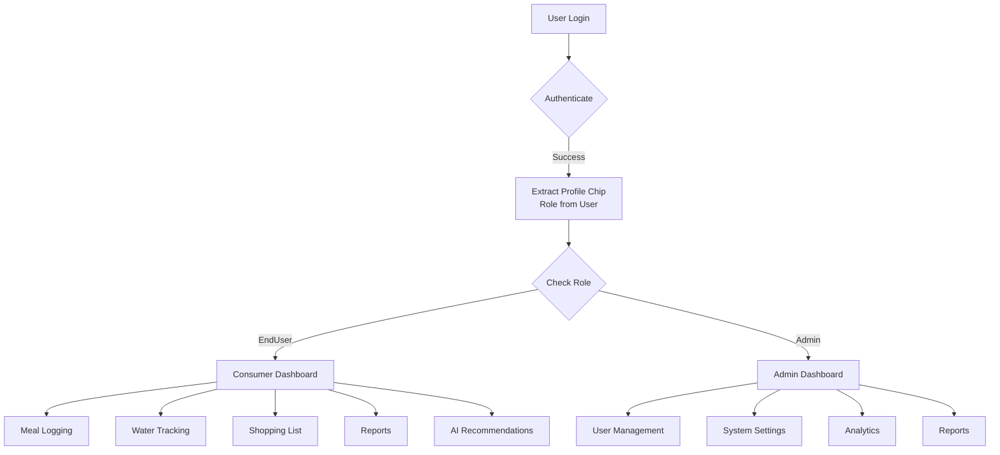

# OOP Concepts, Auth Flow & Profile Chips Analysis

## 1. OOP Concepts in Your Blazor Project

### A. **Encapsulation**
Encapsulation hides internal implementation details and exposes only necessary information.

```csharp
// Example: User Model
public class User
{
    public int Id { get; set; }
    public string Username { get; set; } = string.Empty;
    public string PasswordHash { get; set; } = string.Empty;  // Sensitive data hidden
    public string Role { get; set; } = "EndUser";  // Profile Chip
}
```

**Why it matters:**
- `PasswordHash` is stored as a hashed value (not plaintext)
- `Role` property encapsulates user permissions

---

### B. **Inheritance**
`AppDbContext` inherits from `DbContext` (Entity Framework Core base class)

```csharp
public class AppDbContext : DbContext
{
    // Inherits all DbContext functionality
    // Methods: SaveChanges(), Add(), Remove(), etc.
}
```

**Benefits:**
- Automatic database operations
- Data validation & tracking
- Lazy loading & change detection

---

### C. **Abstraction**
Entity models abstract database tables and relationships

```csharp
// Model represents a database table
public class Meal
{
    public int Id { get; set; }
    public int UserId { get; set; }  // Foreign key (relationship)
    public string Name { get; set; }
    public double Calories { get; set; }
    public DateTime LoggedAt { get; set; }
}
```

**Abstraction here:**
- Models hide SQL complexity
- DbSets abstract table operations

---

### D. **Polymorphism**
Different entity types (Meal, WaterIntake, HealthReport) implement common patterns

```csharp
// All entities follow a similar pattern
public class Meal { public int UserId { get; set; } ... }
public class WaterIntake { public int UserId { get; set; } ... }
public class HealthReport { public int UserId { get; set; } ... }

// All can be queried polymorphically through their base DbSet
```

---

### E. **Composition**
Entities are composed of properties and relationships

```csharp
// UserGoal composes properties related to user targets
public class UserGoal
{
    public int UserId { get; set; }  // References User
    public double TargetCalories { get; set; }
    public double TargetProtein { get; set; }
    public double TargetWater { get; set; }
    public string TimeZoneId { get; set; }
    public string Region { get; set; }
    public bool IsDarkMode { get; set; }
}
```

---

## 2. Authentication Flow in Your Project

### Authentication Pathway:

```
┌─────────────────────────────────────────────────────────────┐
│                    AUTHENTICATION FLOW                      │
├─────────────────────────────────────────────────────────────┤
│                                                              │
│  1. User Login Request                                      │
│     └─> Username + Password sent to API                    │
│                                                              │
│  2. API Validates Credentials                              │
│     └─> Query User table: SELECT * FROM Users              │
│         WHERE Username = @username                         │
│                                                              │
│  3. Password Verification                                  │
│     └─> Compare hashed PasswordHash with input            │
│         (Using BCrypt or similar)                         │
│                                                              │
│  4. Generate Auth Token (JWT)                              │
│     └─> Token payload includes:                           │
│         - User ID                                         │
│         - Username                                        │
│         - Role (Profile Chip)  ← IMPORTANT              │
│         - Expiration time                                │
│                                                              │
│  5. Send Token to Blazor Client                            │
│     └─> Store in localStorage or secure cookie           │
│                                                              │
│  6. Include Token in API Requests                          │
│     └─> Authorization: Bearer {token}                     │
│                                                              │
│  7. API Validates Token                                    │
│     └─> Extract claims from token                        │
│         Verify signature & expiration                    │
│                                                              │
│  8. Route Based on Role (Profile Chip)                     │
│     └─> Admin → Admin Dashboard                          │
│         EndUser → Consumer Dashboard                     │
│                                                              │
└─────────────────────────────────────────────────────────────┘
```

### Data Model for Authentication:

```csharp
// Core authentication entity
public class User
{
    public int Id { get; set; }
    public string Username { get; set; }
    public string PasswordHash { get; set; }  // Never store plain password
    public string Role { get; set; } = "EndUser";  // Profile Chip/Authorization
}

// Supporting entities
public class UserGoal
{
    public int UserId { get; set; }  // Links to User
    // ... personalization data
}

public class HealthReport
{
    public int UserId { get; set; }  // Ensures data isolation
    // ... user-specific health data
}
```

---

## 3. Profile Chips (Roles/Permissions)

### What are Profile Chips?
Profile chips are **role-based authorization tokens** that determine what features a user can access after authentication.

### Profile Chip Structure in Your App:

```csharp
public class User
{
    public string Role { get; set; } = "EndUser";  // ← Profile Chip
}
```

### Role Types in Your System:

| Role | Features Available | Dashboard Type |
|------|------------------|-----------------|
| **EndUser** (Consumer) | - Log meals<br>- Track water<br>- View reports<br>- Shopping list<br>- AI recommendations | Personalized Consumer Dashboard |
| **Admin** | - Manage users<br>- View all reports<br>- System settings<br>- Analytics | Admin Dashboard |

---

### Profile Chip Flow Diagram:



---

## 4. Implementation Pattern: Role-Based Access Control

### In Your Blazor Component:

```csharp
// Example: Check Profile Chip before displaying features
@if (user.Role == "Admin")
{
    <button @onclick="ManageUsers">Manage Users</button>
    <button @onclick="ViewAnalytics">View Analytics</button>
}
else if (user.Role == "EndUser")
{
    <button @onclick="LogMeal">Log Meal</button>
    <button @onclick="TrackWater">Track Water</button>
}
```

### In Your API:

```csharp
// Example: Authorize API endpoint based on role
[Authorize(Roles = "Admin")]
[HttpGet("users")]
public async Task<IActionResult> GetAllUsers()
{
    var users = await _context.Users.ToListAsync();
    return Ok(users);
}

[Authorize(Roles = "EndUser,Admin")]
[HttpPost("meals")]
public async Task<IActionResult> LogMeal(Meal meal)
{
    // Only authenticated users can log meals
    _context.Meals.Add(meal);
    await _context.SaveChangesAsync();
    return Ok();
}
```

---

## 5. Data Isolation Based on Profile Chips:

### Consumer (EndUser) sees only their data:
```csharp
// API method ensuring data isolation
public async Task<UserGoal> GetUserGoal(int userId)
{
    // Only returns goal for the authenticated user
    return await _context.UserGoals
        .FirstOrDefaultAsync(g => g.UserId == userId);
}
```

### Admin sees all data:
```csharp
// Admin can access all user data
public async Task<List<User>> GetAllUsers()
{
    return await _context.Users.ToListAsync();
}
```

---

## 6. Security Best Practices:

| Concept | Implementation |
|---------|-----------------|
| **Password Storage** | Store `PasswordHash` (never plaintext) using BCrypt |
| **Token Generation** | Include `Role` in JWT claims |
| **Token Validation** | Verify signature, expiration, and role before granting access |
| **Data Isolation** | Filter queries by `UserId` for EndUsers |
| **Attribute-based Auth** | Use `[Authorize(Roles = "...")]` on controllers |

---

## Summary Table:

| Concept | Your Implementation | Purpose |
|---------|------------------|---------|
| **OOP: Encapsulation** | User model with PasswordHash property | Hide sensitive authentication data |
| **OOP: Inheritance** | AppDbContext extends DbContext | Leverage EF Core functionality |
| **OOP: Abstraction** | Entity models abstract DB tables | Simplify database operations |
| **Auth Flow** | Username → Password Verify → JWT Token | Secure user authentication |
| **Profile Chips** | User.Role property ("EndUser", "Admin") | Role-based access control |
| **Data Model** | UserId foreign keys in all entities | Ensure multi-tenancy & security |
